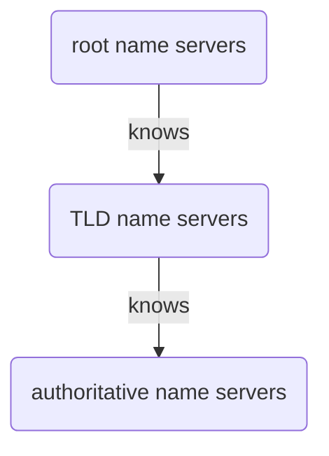
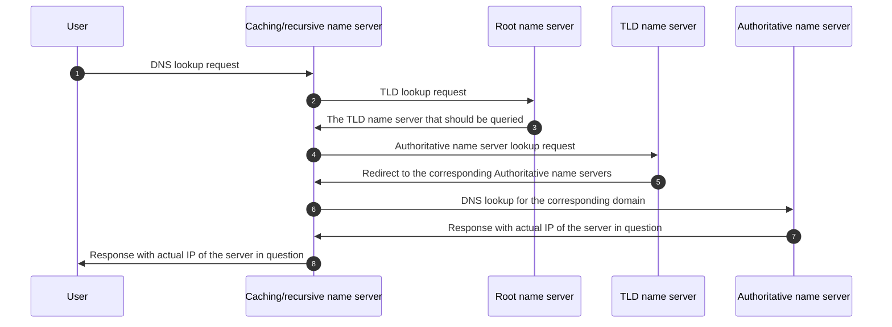

## What is DNS?

Domain Name System is a service/protocol that provides **Name Resolution** funtionality.

**Name Resolution** is the process of converting domain names (human-readable words as web addresses)
into IP addresses ([dot-decimal notation][ddn]), which can be understood by computers.


## Why DNS?

Humans are bad at remembering numbers, we simply cannot remember all the websites' addresses in IP numbers.
In addition, with the help of DNS service, you can then change a website's IP address without changing the
corresponding domain name, thus making the web more 'predictable'.


## How does DNS work?

To provide such service, there exist many DNS server(s) to fulfill the job. They are the backbone of internet.
In simple terms, what happens is that the 'client computer/program' makes a DNS lookup request to the DNS
system (comprised of a group of servers), and the system eventually responds with the correct
IP address of the requested domain name to the client. From this, you can easily deduce that DNS service,
just like many other networked services, follows the 'Client-Server' model of communication.

As indicated above, DNS lookup could (for example, a full lookup) involve many name servers. These servers
exchange information in a *hierarchical* manner before eventually giving back the final answer to the client.

To elaborate, different DNS name servers are playing different 'roles' during serving a DNS lookup request.
These different roles forms the hierarchical nature of communication. There are *five* main such roles of
name servers:

Caching name servers (provided by ISP or local network)
: Store known domain name lookups for a certain amount of time (provided by ISP or local network)
  so that a full DNS lookup can be avoided.

Recursive name servers (provided by ISP or local network)
: Performs full DNS resolution requests. A local name server is typically both a caching and recursive
  name server; in other words, the functinalities of both roles are fulfilled in one server. So, for a
  DNS lookup request, if the local name server cannot find a cached lookup request/response, it then
  performs a recursive DNS lookup on behalf of the client, and once the answer of the request is found,
  then it caches the new response. This is the server that's directly contacted by the DNS client.

Root name servers
: 13 Authorities that provide root name lookups as a service. Responsible for directing the queries to
  the right TLD name servers. These servers are always the first ones to contact during the full DNS
  lookup.

TLD (Top-Level Domain) name servers
: Represents top of the hierarchical DNS name resolution system. A TLD name is the last part of a domain
  name. For example **.com** in www.facebook.com. A TLD name server is responsible for directing the
  query to the correct authoritative name servers.

Authoritative name servers
: Name servers that are responsible for translating the last two parts of the domain name to correct
  IP address (for example, for a request of looking up **facebook.com**, it may respond with IP w.x.y.z).

Given the roles described above, we can easily visualize the hierarchy as follows (root name servers
at the top):



Equipped with the basic knowledge of what each component in a DNS system does, let's now see how all of
them work together in the action of a full DNS lookup:



It is easy to notice that there is a lot of message exchange for a full DNS lookup! That's why
we need caching mechanism (e.g. caching name server) in the system! In addition to that, the client
(your desktop computer, moblie phone, laptop, table, etc.) itself also caches DNS lookup responses
to avoid even looking up again! To make expensive DNS lookup faster, DNS usually uses **UDP** as its
transport layer protocol under the hood (DNS itself is an **application layer** protocol).

Please note that root name servers and TLD name servers are usually distributed globally, with many servers
sharing the same IP address. For the local name server to find _ONE_ root/TLD name server to contact to, it
uses a technique called __Anycast__[^anycast]. It is basically a _one-to-one-of-many_[^routing-wiki] message
delivery scheme where usually the nearst node is picked as the message destination.

## How to Configure DNS

As we can see above, there are a lot machines involved in resolving a single name! To make them all work
together flawlessly, correct *DNS configurations* are needed on those machines involved. To be more specific,
different configurations are put on different *layers* of the system. Below is some practical
information on configuring some parts of the system.

### Configure Local DNS server (User/Client Node)

This is done at the **User/Client** node, which is the local machine initially requesting DNS lookup.
It is logical to imagine that the local machine needs to know where its corresponding **Recursive Name Server**
is to send the very first lookup request. That is why this information needs to be configured
per machine/node.

For SOHO (Small Office Home Office) network on Linux machines, such information used to be manually configured
in `/etc/resolv.conf`; but now it is usually done automatically by `systemd-resolved`, which is the internal DNS
stub resolver. I check the IP of the local DNS server resolver by using commands like:

```bash
# Use `dig` or `nslookup` to resolve the domain name of `google.com`
# These commands will ALSO display the IP address of the DNS server that
# was used to resolved the domain name of `google.com`.
$ dig google.com
# Or
$ nslookup google.com
Server:         127.0.0.53
Address:        127.0.0.53#53

Non-authoritative answer:
Name:   google.com
Address: 142.250.179.174
Name:   google.com
Address: 2a00:1450:400e:802::200e
```

The output of the commands says that `127.0.0.53` (listening on port `53`) is the
address of the local caching resolver. Most distributions of Linux nowadays use local
resolvers, which essentially cache DNS lookup results on your local computer.

Local caching resolver tries to fulfill DNS lookup request immediately, if that's not
possible, it then forwards the request to the upstream DNS servers, for example, an upstream
Cache/Recursive Name Server. In a SOHO network, it is common to have a built-in DNS server
running in the home router. This is usually the first DNS server outside the local machine
in a SOHO network. Note that the DNS server in the SOHO network router is likely also just
a DNS caching server.

I figured out what the IP address of the DNS server running inside my home router by the
following command:

```bash
# Use the CLI of NetworkManager, `nmcli`, to find out the IP address
# of DNS server in the router
$ nmcli dev show <interface name> | grep 'IP.DNS'
```


### Configure Authoritative Name Servers

After configuring your local DNS server, the next thing to configure is the authoritative name servers.
We usually do so via the GUI interface provided by the domain registrar/DNS provider.

One important thing to do is configuring **DNS records**. DNS records tells the name servers how different
domain names are resolved into different IP addresses and services.

There are different DNS record resource types, which allow different kinds of name resolution to take
place. Below is some of the most important DNS record resource types:

#### DNS resource types

DNS operates with a set of different resource types. This allows different kinds of DNS resolution.

A record
: Point a certain domain name at a certain IPv4 address. This is the most common/basic DNS record in use.
  For example, mapping `example.com` to `192.0.2.1`.

Quad A (AAAA) record
: Similar to A record, but returns an IPv6 address instead of IPv4 address.

CNAME (Canonical Name) record
: Used to redirect traffic from one domain name to another. Allowing multiple domain names to resolve to
  the same IP address. Super commonly used. This means whenever the IP address of your service is changed,
  you only need to change ONE **A record** for all the related domain names.

MX (Mail Exchange) record
: Specifies the mail servers responsible for receiving email for the domain. Only used for mail services.

SRV (Service) record
: Used to define the location of various specific services. Can be used for many different specific services.

TXT (Text) record
: Originally intended to be used only for associating some descriptive
  text with a domain name for human consumption. Nowadays it is used to
  communicate configuration preferences about network services.

NS (Name Server) record
: Indicates which name servers are authoritative for the domain.


## Footnotes
[^anycast]: See [Anycast](https://en.wikipedia.org/wiki/Anycast)
[^routing-wiki]: See [Routing](https://en.wikipedia.org/wiki/Routing)

[ddn]: https://en.wikipedia.org/wiki/Dot-decimal_notation