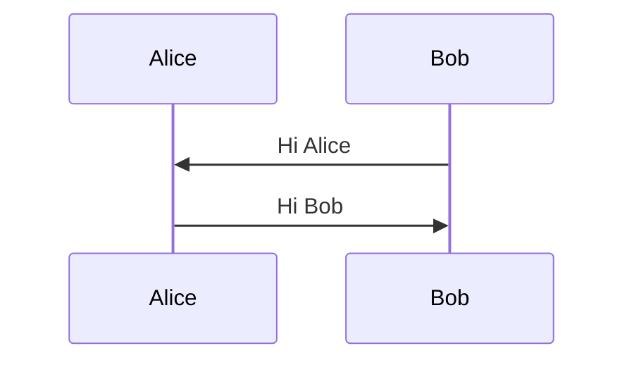

## What is DNS?

Domain Name System is a service/protocol that provides **Name Resolution** funtionality.

**Name Resolution** is the process of converting domain names (human-readable words as web addresses)
into IP addresses ([dot-decimal notation][ddn]), which can be understood by computers.

## Why DNS?

Humans are bad at remembering numbers, we simply cannot remember all the websites' addresses in their
IP numbers. In addition, with the help of DNS service, you can then change a website's IP address without
changing the corresponding domain name.

## How does DNS work?

To provide such service, you need to have DNS server(s) running on a network. Thus, DNS service also follows
the 'Client-Server' model of communication.

There are *five* main types of DNS servers:

- Caching name servers
- Recursive name servers
- Root name servers
- TLD (Top-Level Domain) name servers
- Authoritative name servers

Also note that DNS is an **application layer** protocol which is mainly running on top of **UDP** as its
transport layer protocol.

DNS (Domain Name System) has hierarchical structure. Participants of the system:

[Anycast][anycast]

### DNS resource types

DNS operates with a set of different resource types. This allows different kinds of DNS resolution.

A record
: Point a certain domain name at a certain IPv4 address. This is the most common/basic DNS record in use.

Quad A record
: Similar to A record, but returns an IPv6 address instead of IPv4 address.

CNAME (Canonical Name) record
: Used to redirect traffic from one domain name to another. Super commonly used. This
  allows the website to have only one canonical IP address for multiple domain names. And whenever you
  need to change the IP address for the service, you only need to change ONE IP address for all the related
  domain name.

MX (Mail Exchange) record
: Used to deliver email to the correct server. Only used for mail services.

SRV (Service) record
: Used to define the location of various specific services. Can be used for many different specific services.

TXT (Text) record
: Originally intended to be used only for associating some descriptive
  text with a domain name for human consumption. Nowadays it is used to
  communicate configuration preferences about network services.

NS (Name Server) record
: Indicate other name servers that might also be responsible for this zone.

[anycast]: https://en.wikipedia.org/wiki/Anycast
[ddn]: https://en.wikipedia.org/wiki/Dot-decimal_notation