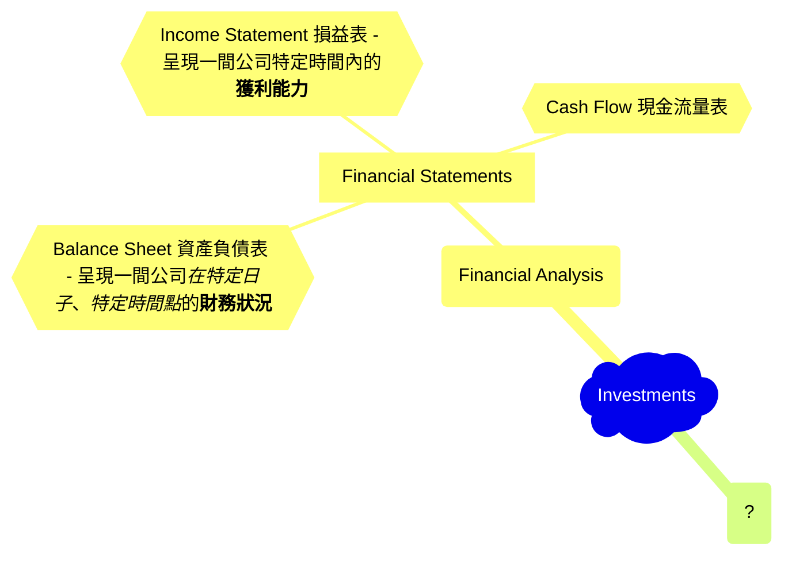
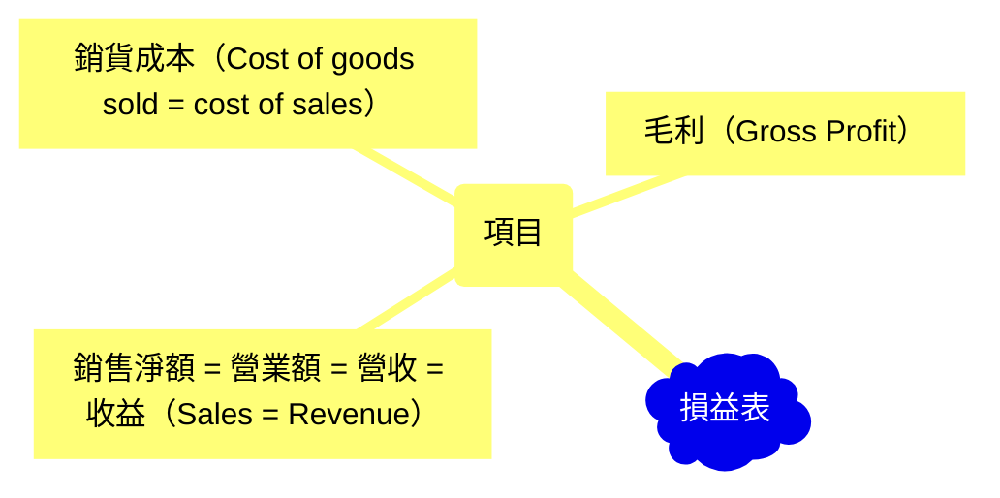

## Overview Mindmap of Investments

Gross profit = net sales – cost of goods sold
Gross margin = [(net sales – cost of goods sold)/net sales] × 100%.

So gross profit != gross margin.

Gross margin is in a ratio!

## Terminology

First, you need to understand what an **Index** is:

- [指數是什麼][index]
- 指數ETF可透過[台股複委託][sub-brokerage]來購買
- 綜觀[全球指數][global-index]，找到低風險的投資資產
- [加權指數（Weighted Stock Index）][wsi]
- 台股加權指數 = [TAIEX][taiex]
- [債卷101][bonds]
- [什麼是平準金？][balance]
- 何謂[價值投資][value-investment]和如何操作？
- 何謂[股票內盤外盤][in-out]

## Good Resources for Original Information

1. [Trading Economics][tradingeconomics]
2. [Information about stocks in Taiwan][goodinfo]

## Practical Information

- Important dates for TWSE: [台股行事曆][agenda]
- [財報怎麼看?][f-statements]
- [限價 vs 市價][limited-market]

## Where To Find Important Information

- Find expenses of ETFs in Taiwan: https://www.sitca.org.tw/ROC/Industry/IN2211.aspx?pid=IN2222_01
- Find expenses of ETFs of US stock market: https://etfdb.com/screener/ and check `Expense Ratio` information.

[index]: https://rich01.com/what-is-index-0/
[global-index]: https://rich01.com/global-important-index-review/
[sub-brokerage]: https://rich01.com/what-sub-brokerage/
[wsi]: https://rich01.com/blog-pos-19/
[taiex]: https://en.wikipedia.org/wiki/TAIEX
[bonds]: https://rich01.com/what-is-bonds/
[tradingeconomics]: https://tradingeconomics.com/
[goodinfo]: https://goodinfo.tw/tw/index.asp
[agenda]: https://rich01.com/invest-schedule/
[f-statements]: https://rich01.com/read-financial-statements/?
[limited-market]: https://rich01.com/rod-ioc-fok-aon-01/
[balance]: https://rich01.com/fund-dividend-balance/
[value-investment]: https://rich01.com/what-is-value-investing/
[in-out]: https://rich01.com/sell-buy-in-out-ratio/
