## Overview Mindmap of Investments

```mermaid
mindmap
  root)Investments(
    core1(Financial Analysis)
      fa-branch1[Financial Statements]
        fs1{{"`Balance Sheet 資產負債表 - 呈現一間公司*在特定日子*、*特定時間點*的**財務狀況**`"}}
        fs2{{"`Income Statement 損益表 - 呈現一間公司特定時間內的**獲利能力**`"}}
        fs3{{Cash Flow 現金流量表}}
    core2(?)
```

```mermaid
mindmap
  root)損益表(
    branch(項目)
      item1[銷售淨額 = 營業額 = 營收 = 收益（Sales = Revenue）]
      item2[銷貨成本（Cost of goods sold = cost of sales）]
      item3[毛利（Gross Profit）]
      item4[費用（Operating Expense）]
```

- Gross profit = net sales – cost of goods sold
- Gross margin = [(net sales – cost of goods sold)/net sales] × 100%.

So, gross profit != gross margin.

Gross margin is in a ratio!

**現金流量表**純粹只關注「現金」，呈現的是一段時間內一間公司的現金變動。Top line: 期初現金，bottom line: 期末現金餘額。

## Financial Statements

> 財報紀錄 現金，貨物和服務流入及流出公司的狀況，這就是財報的核心。其他都是小細節。

- **損益表** （Income Statement）: 一間公司生產和販售產品的活動中，所帶來的利潤或損失。
- **現金流量表** （Cash Flow）: 報告一間公司現金流入或流出的流動狀況。
- **資產負債表** （Balance Sheet）: 記錄一間公司所擁有和所欠的東西，其中也包括了所有權人的權益。

注意*損益表*和*現金流量表*都是報告一個**特定期間內**的活動，但*資產負債表*卻是報告**到特定日期止**。
所以資產負債表是一個公司<ins>累積一段時間後</ins>的整體財務狀況的總結！

### Connections among financial statements

從幾個角度來看報表之間的連結：

0. 資產負債表恆真關係
1. 銷售循環
2. 費用循環
3. 投資循環
4. 資產取得/折舊循環

#### 資產負債表恆真關係

- <ins>現金流量表</ins>上的**期末現金餘額**一定要等於<ins>資產負債表</ins>上的**現金**科目
- 在<ins>資產負債表</ins>裡，**總資產**一定要等於**總負債**加**股東權益** => `資產 = 總負債 + 股東權益` 這是橫等式！
- <ins>資產負債表</ins>內部必須維持平衡。

#### 銷售循環

```mermaid
flowchart LR
    n1(1️⃣賒銷成立) --> n2(2️⃣銷售成立) --> n3(3️⃣客戶支付已交貨貨款) --> n4(4️⃣銷售完成)
```

- 1️⃣：(**損益表**💶<ins>銷售額</ins>)↗️ ↔️ (**資產負債表**💶<ins>應收賬款</ins>)↗️ 應增加相同金額
- 2️⃣：
- 3️⃣：
- 4️⃣：

TODO:↘️

#### 費用循環
#### 投資循環
#### 資產取得/折舊循環

- 損益表裏的**本期淨利**會加到資產負債表的**保留盈餘**，**股東權益**因此會增加。
- 損益表裏的**銷貨淨額**和資產負債表的**應收賬款**是連動的，銷貨淨額增加代表*賒銷*產生，所以應收帳款應該要增加!
- 當銷售成立時，就代表貨品出售了，資產負債表的**存貨**就應該減少，減少的量就增加到損益表裏的**銷貨成本**。

Question: 資產與負債要一直保持均衡，為什麼？資產 = 總負債 + 股東權益
Question: 如何解釋股東權益？

## Terminology

First, you need to understand what an **Index** is:

- [指數是什麼][index]
- 指數ETF可透過[台股複委託][sub-brokerage]來購買
- 綜觀[全球指數][global-index]，找到低風險的投資資產
- [加權指數（Weighted Stock Index）][wsi]
- 台股加權指數 = [TAIEX][taiex]
- [債卷101][bonds]
- [什麼是平準金？][balance]
- 何謂[價值投資][value-investment]和如何操作？
- 何謂[股票內盤外盤][in-out]

## Good Resources for Original Information

1. [Trading Economics][tradingeconomics]
2. [Information about stocks in Taiwan][goodinfo]

## Practical Information

- Important dates for TWSE: [台股行事曆][agenda]
- [財報怎麼看?][f-statements]
- [限價 vs 市價][limited-market]

## Where To Find Important Information

- Find expenses of ETFs in Taiwan: https://www.sitca.org.tw/ROC/Industry/IN2211.aspx?pid=IN2222_01
- Find expenses of ETFs of US stock market: https://etfdb.com/screener/ and check `Expense Ratio` information.

[index]: https://rich01.com/what-is-index-0/
[global-index]: https://rich01.com/global-important-index-review/
[sub-brokerage]: https://rich01.com/what-sub-brokerage/
[wsi]: https://rich01.com/blog-pos-19/
[taiex]: https://en.wikipedia.org/wiki/TAIEX
[bonds]: https://rich01.com/what-is-bonds/
[tradingeconomics]: https://tradingeconomics.com/
[goodinfo]: https://goodinfo.tw/tw/index.asp
[agenda]: https://rich01.com/invest-schedule/
[f-statements]: https://rich01.com/read-financial-statements/?
[limited-market]: https://rich01.com/rod-ioc-fok-aon-01/
[balance]: https://rich01.com/fund-dividend-balance/
[value-investment]: https://rich01.com/what-is-value-investing/
[in-out]: https://rich01.com/sell-buy-in-out-ratio/
