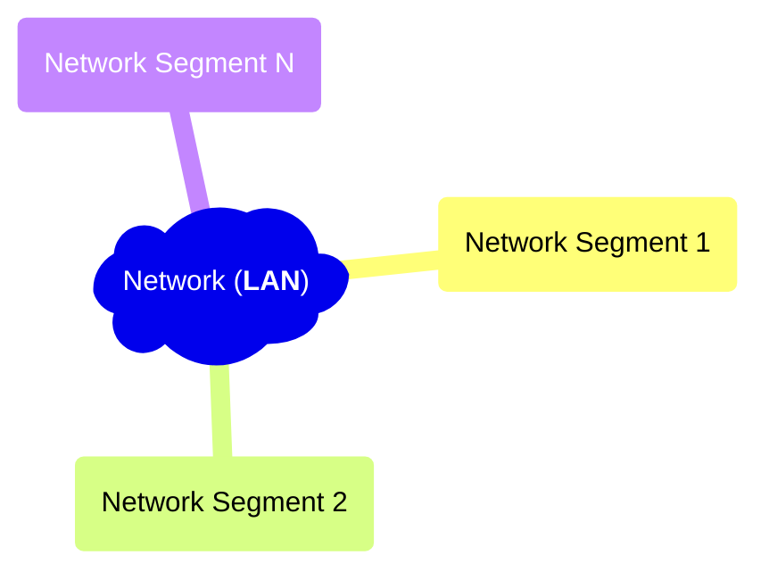

This post is the summary / note from online free network course: ['From LAN to VXLAN: Networking Basics for Non-Network Engineers'][lan-to-vxlan]




```text
         link
node <----------> node
```

## Terminology

Network Segment
: Broadly speaking, a portion of a computer network. But the actual definition is technology-specific.

LAN
: Local Area Network.

[Full-Duplex][full-duplex]
: A full-duplex (FDX) system allows communication in both directions, and, unlike half-duplex, allows this to happen simultaneously.

L1 Segment
: aka **physical segment**, **Ethernet segment**. Nodes on a single L1 segment have a common physical layer.

In the old days, old technologies like nodes connected with simple *shared coaxial cables*, or, nodes connected
with a 'repeater hub' and twisted-pair cables, those nodes are forming one broadcast domain as well as a collision
domain.

Nowadays, this does not happen in Ethernet networks anymore, because now the use of 'switch' (a.k.a. bridge) is more common
(instead of a repeater hub); a broadcast domain is limited between the end-node and and the switch, and the link between them
is with full-duplex wiring technology.

L2 Segment
: Multiple L1 segments interconnected using a shared switch (aka bridge), or, multiple L2 segments merged into a bigger L2 segment
  by an upper-layer switch. Nodes can communicate with each other using their L2 addresses (MAC) (1:1 communication) or by
  broadcasting frames (1:N). While L1 segments are about the *physical connectivity* of nodes, L2 segments are rather about
  **logical connectivity**.

Broadcast Domain
: all nodes of a single L2 segment; the nodes that can reach each other using a broadcast L2 address (ff:ff:ff:ff:ff:ff).

VLAN
: any broadcast domain that is partitioned and isolated at the data link layer (L2). It can be seen as the *inverse* to
  bridging. Bridges merge two L2 segments into one bigger L2 segment. VLANs split a single L2 segment into multiple
  non-intersecting L2 segments (and broadcast domains). The way this is implemented is by adding/tagging Ethernet frames
  with VIDs (Virtual IDs; these are some extra bytes in the Ethernet frames). Each VID forms a separate broadcast domain.
  VLANs can keep network applications separate despite being connected to the same physical (or virtual) network. VLANs
  are data link layer (OSI layer 2) constructs.

L3 Segment
: same as IP subnetwork (e.g. 192.168.0/24 or 172.18.0.0/16).

VXLAN
: Virtual eXtensible LAN (VXLAN) is a network virtualization technology that uses a VLAN-like encapsulation technique to
  encapsulate OSI layer 2 Ethernet frames within layer 4 UDP datagrams. It is a tunneling technology. It basically encapsulates
  virtual L2 segment inside UDP datagram. It allows multiple L3 network/nodes to join into one L2 segment.

## Important Concepts

- Communication WITHIN a single L3 segment only needs ARP (IPv4) / NRP (IPv6) to translate destination IP into MAC and
  encapsulate IP packet into L2 segment frame before transmitting it. Transmission is done in L2 segment.
- Communication between any two L3 segments always requires at least one router.
- Bridge vs. Router TODO

## How Things Work


[lan-to-vxlan]: https://labs.iximiuz.com/courses/computer-networking-fundamentals/from-lan-to-vxlan
[full-duplex]: https://en.wikipedia.org/wiki/Duplex_(telecommunications)#Full_duplex
