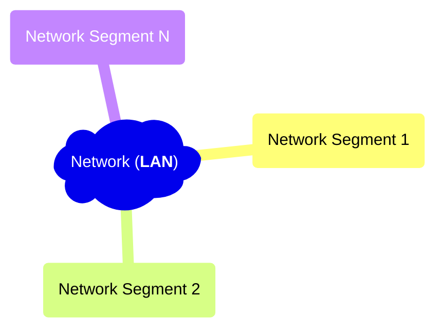

This post is the summary / note from online free network course: ['From LAN to VXLAN: Networking Basics for Non-Network Engineers'][lan-to-vxlan]

- node
- network link
- LAN = Local Area Network
- L1 segment
- L2 segment
- L3 segment
- What is a segment?

[lan-to-vxlan]: https://labs.iximiuz.com/courses/computer-networking-fundamentals/from-lan-to-vxlan
