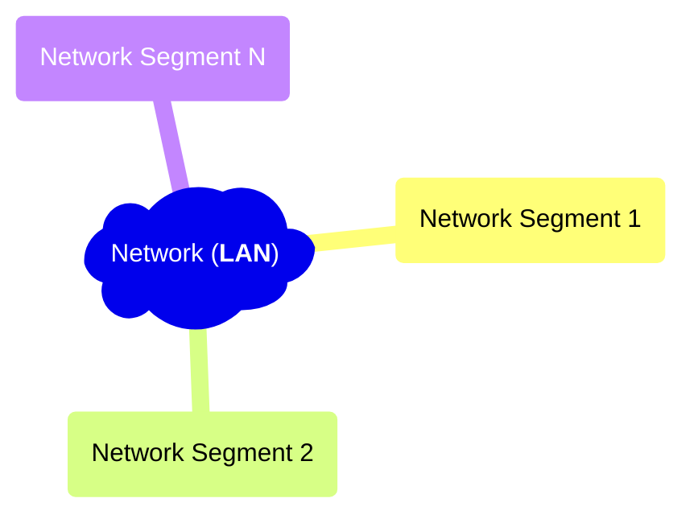

This post is the summary / note from online free network course: ['From LAN to VXLAN: Networking Basics for Non-Network Engineers'][lan-to-vxlan]




```text
         link
node <----------> node
```

## Terminology

Network Segment
: Broadly speaking, a portion of a computer network. But the actual definition is technology-specific.

LAN
: Local Area Network.

[Full-Duplex][full-duplex]
: A full-duplex (FDX) system allows communication in both directions, and, unlike half-duplex, allows this to happen simultaneously.

L1 Segment
: aka **physical segment**, **Ethernet segment**. Nodes on a single L1 segment have a common physical layer.

In the old days, old technologies like nodes connected with simple *shared coaxial cables*, or, nodes connected
with a 'repeater hub' and twisted-pair cables, those nodes are forming one broadcast domain as well as a collision
domain.

Nowadays, this does not happen in Ethernet networks anymore, because now the use of 'switch' (a.k.a. bridge) is more common
(instead of a repeater hub); a broadcast domain is limited between the end-node and and the switch, and the link between them
is with full-duplex wiring technology.

L2 Segment
: TODO

L3 Segment
: TODO


[lan-to-vxlan]: https://labs.iximiuz.com/courses/computer-networking-fundamentals/from-lan-to-vxlan
[full-duplex]: https://en.wikipedia.org/wiki/Duplex_(telecommunications)#Full_duplex
