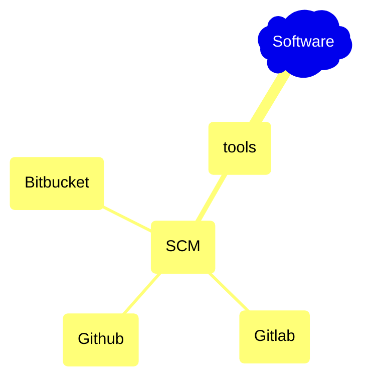

This post is to sort all my thinking and knowledge regarding software into a mindmap
so that I can more easily reason about it and extend/build more knowledge on top of it.

```mermaid
mindmap
  root)Software(
    l1(tools)
      l2(SCM)
        l3-ex1(Github)
        l3-ex2(Gitlab)
        l3-ex3(Bitbucket)
```

