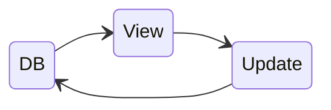
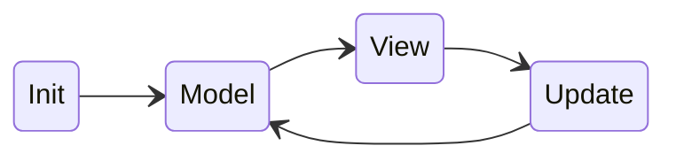

Recently I learned something useful regarding functional programming language and web frontend
development: [**Elm**][elm] and [**The Elm Architecture** (TEA)][tea].

TEA is a design pattern: `Model` ➡️ `View` ➡️ `Update`, which facilitates uni-directional data flow.
That makes Web UI development *simple* and *clean*. In addition, the 'functional' approach of Elm makes
the Web UI components easier to test (I like 😉). For more details about TEA, you can refer to
[this diagram here][tea-explanation].

Having learned this technique, I couldn't resist to play with it and see how it can transform Web UI
development! So I decided to try it in my personal project, [`recipy`][recipy] (a simple local-first
recipe app).

I want to create this app because I cooked a lot, and I need to refer to my personal recipes from
time to time (as I couldn't remember all the details, and I have a lot (`> 100`) of recipes ). I need
some way to manage the information and search/reference recipes easily and quickly while
cooking.

In the meantime, I was curious about a Python UI library, [`NiceGUI`][nicegui], it seems to be a
very convenient component-based Web UI development framework which lets you do Web UI development
completely in Python (no JS, CSS and HTML)!

For a POC, I decided to try making `recipy` with `NiceGUI` and applying the ideas from **TEA**.

Before giving some of the details of the code, I'd like to outline some high level design decisions
first:

1. `recipy` is a simple recipe management app, it doesn't have complicated UIs and states, so I
   intentionally kept state management simple and kept state *only* in the database. The choice
   of database is **SQLite**, because this app is *a private, local-first*, not a service.
2. Because of the simple state management choice, the implementation is not really following TEA
   per se, TEA is only applied partially for this project. So the data flow looks like this:
3. I chose MPA over SPA for `recipy`. This is a natural consequence of the first decision.
   Note: in **NiceGUI**, it is also possible to implement SPA via [`ui.sub_pages`][nicegui-subpages].

Because of this design choice, the data flow of the application looks like this:



which is simpler than the data flow of TEA:



```python
-- View
-- Update
```


[elm]: https://guide.elm-lang.org
[tea]: https://guide.elm-lang.org/architecture/
[tea-explanation]: https://sporto.github.io/elm-workshop/03-tea/01-intro.html
[recipy]: https://gitlab.com/keenhenry/recipy
[nicegui]: https://nicegui.io
[nicegui-subpages]: https://nicegui.io/documentation/sub_pages
