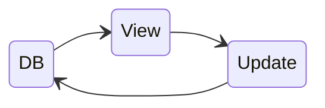
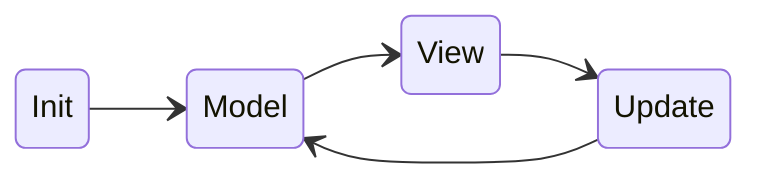

## Background: The Elm Architecture (TEA) and Python Web Development

Recently, I learned something really useful about functional programming languages and web frontend
development: [**Elm**][elm] and [**The Elm Architecture** (TEA)][tea].

TEA is a design pattern: `Model` ➡️ `View` ➡️ `Update`, which enforces a uni-directional data flow.
This makes Web UI development *simple* and *clean*. Additionally, Elm's functional approach makes
Web UI components easier to test (which I love 😉). For a detailed visual explanation of TEA, you can check
[this diagram][tea-explanation].

After learning this technique, I couldn’t resist experimenting with it to see how it can transform Web UI
development! So, I decided to try it in my personal project, [`recipy`][recipy]—a **private**, **local-first**
recipe app.

I created this app because I cook a lot, and I need a way to reference my personal recipes quickly
and efficiently (I have over 100 recipes, and remembering all the details is impossible). I wanted
a system to manage recipe information and search/reference it easily while cooking.

Meanwhile, I became curious about a Python UI library, [`NiceGUI`][nicegui]. It appears to be a
convenient, component-based Web UI framework that allows full web development in Python—no JS, CSS, or HTML required!

With this curiosity, I decided to build `recipy` using `NiceGUI` while applying ideas from **TEA**.

---

## High-Level Design Decisions: Applying TEA in a Python Web App

Before diving into the code, here are the high-level design decisions I made:

1. `recipy` is a simple recipe management app with uncomplicated UIs and state. Therefore, I intentionally
   kept state management simple, storing state *only* in the database. I chose **SQLite**, since this
   app is *private and local-first*, not a cloud service.
2. Because of this simple state choice, the implementation doesn’t fully follow TEA. TEA is applied only partially.
3. I chose an MPA (Multi-Page Application) over SPA (Single-Page Application) for `recipy`. This choice naturally
   follows from the previous decision. Note: **NiceGUI** also allows SPA via `ui.sub_pages`[^nicegui-subpages].
4. TEA is partially applied in the sense that the `Model` is replaced with the database (`DB`). Views are still
   functions of the current state (from the database), and when events/actions occur in UI components, the `Update`
   function is invoked. `Update` acts as a central handler for events, making changes to the database and refreshing
   the UI as needed. You can think of `Update` as the **Repository** in the *Repository Design Pattern*[^repository].

Conceptually, the data flow of the app looks like this:



Simpler than the traditional TEA flow:


---

## Implementing TEA Concepts in NiceGUI

Here are the parts of the code where I applied TEA concepts:

- Instead of using OOP classes to implement the repository pattern, I went functional and followed TEA conventions:

```python
# Data model type aliases
type Recipes = list[Recipe]
type Model = Recipes
type RecipeOrError = Recipe | ValidationError

# Event, action and message type alias
type Action = Literal['Create', 'Update', 'Delete']
type Message = tuple[Action, RecipeOrError]


# -- View => the 'view' functions
def view_recipes(model: Model):
    ...

def view_recipe(recipe: Recipe):
    ...


# -- Update => the 'update' function
def update(message: Message, old_recipes: Model) -> Model:
    """This function handles ALL the events on control UIs in the application"""
    ...
```

- A 'view' is always a function of some 'state', for example:

```python
def view_recipe(recipe: Recipe):
    """View function to show the details of a recipe"""
```

- User actions are UI events modeled as input 'messages' to the update function. For example,
  a callback for clicking the 'delete' button:

```python
for recipe in model:
    with ui.item():
        with ui.item_section().props('side'):
            ui.button(
                icon='delete',
                on_click=lambda r=recipe: update(('Delete', r), model),
            ).classes(...)
```

- The update function uses **structural pattern matching**[^pep-636] (introduced since Python 3.10+) to handle different events,
  just like how it's done in TEA:

```python
-- Update
def update(message: Message, old_recipes: Model) -> Model:
    """Update the data model based on the message received from the UI"""

    match message:
        case ('Create', value) if type(value) is Recipe:
            # TODO: database write
            ui.notify(f'Recipe {value.name} saved!')

        case ('Update', value) if type(value) is Recipe:
            # TODO: database write
            ui.notify(f'Recipe {value.name} updated!')

        case ('Delete', value) if type(value) is Recipe:
            # TODO: database write
            ui.notify(f'Recipe {value.name} deleted!')

        case (_, error) if type(error) is ValidationError:
            ui.notify(
                f'Recipe data incorrect: {error}!',
                type='warning',
                multi_line=True,
            )

        case _:
            raise ValueError(f'Unknown message: {message}')
    ...
```

- Unlike Elm, which 'automatically' redraws the view (by Elm runtime) after an update, NiceGUI requires manually
  refreshing the view. The `refreshable` function[^refreshable] makes this easy (a nice feature - I like 😉):

```python
# -- Upate --
def update(message: Message, old_recipes: Model) -> Model:
    """Update the data model based on the message received from the UI"""

    match message:
        ...

    # Get new state from database and refresh UI with the new state
    model = load_recipes(DATA_FILE)
    view_recipes.refresh(model)
    return model
```
---

## Benefits of Using TEA with NiceGUI in Python Web Apps

Here’s what this design achieves:

1. The data flow is unidirectional, mirroring TEA principles.
2. Most functions are pure (side-effect-free). Only `update` and `recipes` functions have side effects for I/O (database access),
   which makes testing much easier.
4. The application state lives exclusively in the database—no additional in-memory state to manage.
5. State changes happen only in the centralized `update` function, acting as a CRUD façade.

Neat! Tot volgende keer!


## Footnotes

[^nicegui-subpages]: See [`ui.sub_pages`](https://nicegui.io/documentation/sub_pages)
[^repository]: See [Repository Design Pattern](https://www.geeksforgeeks.org/system-design/repository-design-pattern/)
[^pep-636]: See [PEP 636](https://peps.python.org/pep-0636/)
[^refreshable]: See NiceGUI [`ui.refreshable`](https://nicegui.io/documentation/refreshable)


[elm]: https://guide.elm-lang.org
[tea]: https://guide.elm-lang.org/architecture/
[tea-explanation]: https://sporto.github.io/elm-workshop/03-tea/01-intro.html
[recipy]: https://gitlab.com/keenhenry/recipy
[nicegui]: https://nicegui.io
