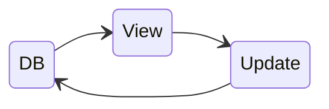
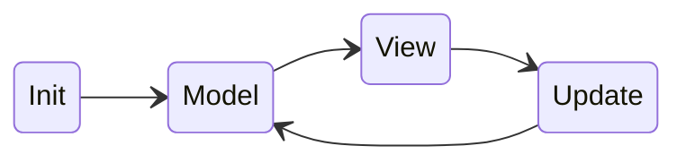

## Background

Recently I learned something useful regarding functional programming language and web frontend
development: [**Elm**][elm] and [**The Elm Architecture** (TEA)][tea].

TEA is a design pattern: `Model` ➡️ `View` ➡️ `Update`, which facilitates uni-directional data flow.
That makes Web UI development *simple* and *clean*. In addition, the 'functional' approach of Elm makes
the Web UI components easier to test (I like 😉). For more details about TEA, you can refer to
[this diagram here][tea-explanation].

Having learned this technique, I couldn't resist to play with it and see how it can transform Web UI
development! So I decided to try it in my personal project, [`recipy`][recipy] (a simple local-first
recipe app).

I want to create this app because I cooked a lot, and I need to refer to my personal recipes from
time to time (as I couldn't remember all the details, and I have a lot (`> 100`) of recipes ). I need
some way to manage the information and search/reference recipes easily and quickly while
cooking.

In the meantime, I was curious about a Python UI library, [`NiceGUI`][nicegui], it seems to be a
very convenient component-based Web UI development framework which lets you do Web UI development
completely in Python (no JS, CSS and HTML)!

With all my curiosity, I decided to try making `recipy` with `NiceGUI` and applying the ideas from
**TEA**.


## The Big Picture

Before giving some of the details of the code, I'd like to outline some high level design decisions
first:

1. `recipy` is a simple recipe management app, it doesn't have complicated UIs and states, so I
   intentionally kept state management simple and kept state *only* in the database. The choice
   of database is **SQLite**, because this app is *a private, local-first*, not a service.
2. Because of the simple state management choice, the implementation is not really following TEA
   per se, TEA is only applied partially for this project. So the data flow looks like this:
3. I chose MPA over SPA for `recipy`. This is a natural consequence of the first decision.
   Note: in **NiceGUI**, it is also possible to implement SPA via `ui.sub_pages`[^nicegui-subpages].
4. **TEA** is applied partially in the sense that the `Model` is replaced with database layer (`DB`),
   and views are still functions of the state (from the database) and when events/actions occured
   in UI components, `Update` is invoked. `Update` is the central place that gets events
   and take actions (by changing state in the database AND refresh UI) accordingly. You can think
   of `Update` as the **Repository** in the *Repository Design Pattern*[^repository].

Because of this reasons above, the data flow of the application conceptually looks like this:



which is simpler than that of TEA:




## The Code

The parts of code that are using TEA concepts:

- Instead of using OOP classes to implement the respoitory pattern, I went *functional* and followed **TEA** convention:

```python
# -- View => 'view' functions
def view_recipes():
    ...

def view_recipe(recipe: Recipe):
    ...

def view_recipe_form(model: Model, recipe: Recipe, action: Action) -> ui.dialog:
    ...

# -- Update => 'update' function
def update(message: Message, old_recipes: Model) -> Model:
    """This function handles ALL the events on control UIs in the application"""
    ...
```

- View functions always take some state as input and generate the 'view' based on that state:

```python
def view_recipe(recipe: Recipe):
    """View function to show the details of a recipe"""
```

- User actions are UI events that are modelled as 'messages' as inputs to `update` function, for example,
  a 'delete' button to remove a recipe:

```python
for recipe in model:
    with ui.item():
        with ui.item_section().props('side'):
            ui.button(
                icon='delete',
                on_click=lambda r=recipe: update(('Delete', r), model),
            ).classes(...)
```

## Footnotes

[^nicegui-subpages]: See [`ui.sub_pages`](https://nicegui.io/documentation/sub_pages)
[^repository]: See [Repository Design Pattern](https://www.geeksforgeeks.org/system-design/repository-design-pattern/)


[elm]: https://guide.elm-lang.org
[tea]: https://guide.elm-lang.org/architecture/
[tea-explanation]: https://sporto.github.io/elm-workshop/03-tea/01-intro.html
[recipy]: https://gitlab.com/keenhenry/recipy
[nicegui]: https://nicegui.io
